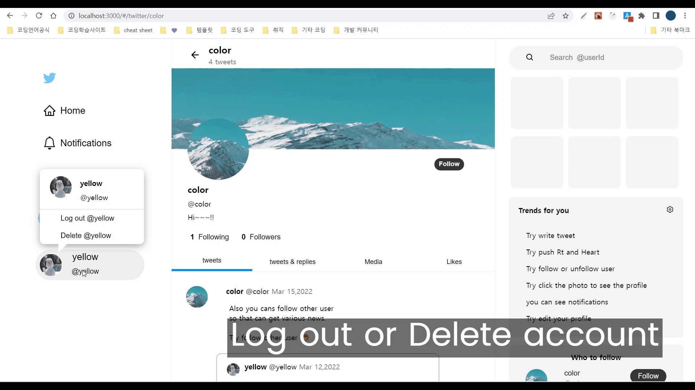
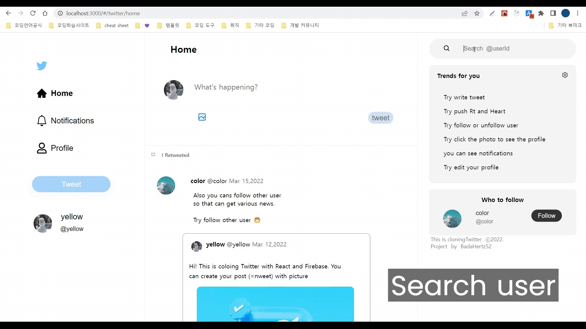

# [Twitter](https://badahertz52.github.io/twitter/)
<br/>

[트위터(twitter)](https://twitter.com/home?lang=ko)를 react와 firebase를 사용하여 클론 코딩한 프로젝트입니다. 

[프로젝트 페이지로 바로가기](https://badahertz52.github.io/twitter/)
_______________________________________________________

## Index
* <a href="#builtWith">Built with</a>
  <br/>

* <a href="#start">Getting Start</a>
  <br/>

* <a href="#description">Description</a>
  <br/>

* <a href="#explain">Explain</a>
  <br/>

  * <a href="#simulation">Simulation</a>
  <br/>
  
  * <a href="#data"> Data </a>
  <br/>

  * <a href="#function"> Function</a>
  <br/>
  * <a href="#update"> Update</a>
  <br/>
* <a href="#blog">Blog</a>
  
_____________________________________________

## <div id="builtWith">Built with </div>

* react  : context
* react-router-dome 
* react-dome
* react-icons
* react-image-crop 
* firebase
* scss

___________________________________________________

## <div id="start"> Getting Start </div>
### Prerequiste
* node.js
  <br/>
  [node.js 설치하러 가기](https://nodejs.org/ko/download/)

* npm
```
 npm install npm@latest -g
```

*  react, react-dom, react-router-dom , react-icon, react-image-crop ,react-helmet
  
  ```
    npx create-react-app react 
    npm install react react-dom
    npm install react-router-dom --save 
    npm install --save react-icon
    npm i react-image-crop --save
    npm i react-helmet
  ```
_____________________________________________________

## Getting Start 
* npm start 
 <br/>

*  yarn start 
*  [프로젝트 페이지 바로가기](https://badahertz52.github.io/twitter/)
 
____________________________________________________
## <div id="description"> Description </div>

twitter를 클론 코딩한 프로젝트로 유저는 다음과 같은 기능을 사용할 수 있습니다.

* 구글 아이디나 다른 이메일로 회원가입 가능하며 해당 계정으로 로그인/로그아웃 가능

* 계정 삭제 가능 단. firebase의 정책 상 로그아웃 후에 계정 삭제가 가능한 경우가 존재함

* 새로운 tweet 작성
  
* 다른 tweet에 대한 reTweet, heart 보내기, 답하기, 인용하기 <br/> (해당 tweet의 작성자에게 알림이 감)
  
* 화면에 보여지는 tweet을 클릭하여 해당 tweet을 더 자세히 볼 수 있음 
  
* 다른 유저를 팔로우, 언팔로우  가능 <br/> (팔로우 시 팔로우한 유저에게 알림이 감) 
  
* search 칸에서 다른 유저 검색 가능
  
* 다른 유저의 프로필 보기, 해당 유저의 following,follower list를 볼 수 있음
  
* 나의 프로필 수정 가능

____________________________________________________
## <div id="explain"> Explain</div>
<br/>
 
### <div id="simulation"> 1. Simulation </div>
  <br/>

#### 1) Responsible web -simulation
<br/>


<br/>

#### 2) Twieer -simulation
<br/>

#### A. Auth 

#### a. sig up and log in
  <br/>


  <br/>

#### b. log out or delete account 
  <br/>

  <br/>

#### B. Tweet 
  <br/>

  <br/>

#### C. Notification

  <br/>

#### D. Profile 

  <br/>

#### E. Search User 


  <br/>

### <div id="data">2. Data </div>
  <br/>

#### A. tweet
  
  |property|explain|type|
  |-----|----|---|
  |docId| 해당 tweet의 문서id 로 차후에 해당 tweet을 찾거나 변경시에 이를 활용함|string|
  |text|해당 tweet의 text |string|
  |attachmentUrl|해당 tweet 작성 시에 첨부한 사진|string|
  |value|해당 tweet의 속성으로 tweet,rt,heart,qt,answer이 있음|string|
  |createdAt|해당 tweet이 작성된 시간으로 연월일시간을 객체로 가지는 배열임|array|
  |creatorId|해당 tweet을 작성한 사용자의 uid|string|
  |about|다른 tweet을 이용한 tweet인 경우(value 값이 rt,heart,answer,qt)에 이용한  tweet에 대한 정보로 docId, creatorId를 가짐|null / object|
  |noticiation|다른 유저가 해당 트윗을 reTweet하거나 마음을 누르거나 인용을 하거나 해당 트윗에 대한 답변을 할 시에 이에 대한 알림들을 저장함. <br/> 배열 속 객체들을 value,aboutDocId,user의 속성을 가짐|array|

#### B. profile
  |property|explain|type|
  |---|----|---|
  |userId| 유저의 id|string|
  |userName|유저의 닉네임|string|
  |photoUrl|유저의 프포필 사진|string|
  |headerUrl|유저의 프로필 헤더|string|
  |introduce|유저의 자기 소개|string|
  |following|유저가 팔로우하는 다른 유저들|array|
  |follower|유저를 팔로우하는 다른 유저들|array|
  |notificaitons|유저에 대한 알림들(유저가 팔로우하는 다른 유저가 새로운 트윗을 작성했거나, 다른 유저가 유저를 팔로우했거나, 유저의 트윗에 대해 rt,heart,answer,qt한 경우에 알림이 생성됨) <br/> 배열 속 객체들은 aboutDocId(다른 유저의 tweet의  docId, follow 와 관련시에는 null 값), docId(유저의 tweet의 docId), user(다른 유저의 uid), value(어떤 알림인지) 를 속성을 가짐|array| 

#### C. Context 
<pre>
  로그인한 계정과 현재 유저가 클릭 한  프로필의 해당 계정의 프로필과 트윗들을 반복적으로 사용되어 서버에 과도한 요청을 주는 경우가 발생했다. 

    이를 해결하기 위해 반복적으로 사용되는 동일한 정보를 "context"를 사용했다. 

  유저가 변경되는 경우(처음 로그인시, 현재의 유저가 다른 유저의 프로필 사진을 눌러 특정 유저가 변경되었을때 ) 에만 서버에서 데이터를 받아오고, 이후에는 이전에 받았던 내용을 다시 사용하도록해서 서버에 대한 과도한 요청을 줄였다.  

  그리고 reducer 를 같이 활용하여 새로운 tweet 작성, 팔로우 취소나 팔로우 요청등의 데이터의 변경을 반영할수 있도로 하였다. 
</pre>


  |context|explain|state|
  |--------|----|---|
  |ProfileContext|currentUser의 프로필에  context|myProfile, profileDispatch, profileInput|
  |TweetContext|currentUser의 트윗에  context|myTweets, allTweets(follower의 tweets 까지 합함), tweetInput, tweetDispatch |
  |UserContext|특정 유저에 대한 프로필과 트윗에 대한 context| userProfile, userTweets, userDispatch|


### <div id="function"> 3. Function</div>
  <br/>
  
  |function|about|explain|js|재사용 가능|
  |--------|-------|------|---|----|
  |getTweetDoc, getTweetsDocs|tweet| 단일 트윗 이나 여러 개의 트윗을 서버에서 가져옴|GetData.js|O|O|
  |getTweet, getTweets|tweet|서버에서 트윗을 가져와서 해당 결과값이 있을 경우 이를 배열이나 객체로 반환함|GetData.js|O|
  |getProfileDoc|profile| 서버에서 프로필 데이터를 가져옴|GetData.js|O|
  |getProfile|profile| getProfileDoc의 결과값이 있을 경우 해당 값을  profile이라는 객체로 반환함|GetData.js|O|
  |updateTweetNofitications| notification| rt,heart,answer,qt 시에 대상이 되는 tweet의 noticiation을 변경함|GetData.js|O|
  |updateProfileNofication|notification| rt, heart,answer,qt 시에 유저 프로필의 noticiation을 변경함 |GetData.js|O|
  |sendNotificaton|notification|  updateProfileNofication 을 사용하여 프로필의 noticiation을 변경함|GetData.js|O|
  |updateMytweetByMe|noticiation| 로그인한 현재의 유저가 자신의 tweet에 대해 rt,heart,answer,qt한 경우 사용됨|GetDate.js|O|
  |deleteTweetNotification| notification| tweet을 삭제하거나 rt,heart를 취소할 경우 관련된 알림을 삭제함|GetData.js|O|
  |deleteProfileNotification| notification| 언팔로우한 경우 관련된 알림을 삭제함|GetData.js|O|
  |OnRtHeart, OffRtHeart| rt,heart| rt,heart 시에 현재 유저의 tweet에 새로운 tweet을 생성하고 rt,heart의 대상인 tweet과 작성자의 noticiation을 변경함 |GetData.js|O|
  |goBack| back page|이전 페이지로 이동함|GetData.js|O|
  |getMedias|medias -profile| 프로필 페이지에서 해당 프로필의 유저가 작성한 tweet중에 첨부된 사진이 있는 경우 해당 사진들을 배열로 만듦|Media.js|X|
  |showTweet, showTaNdA, showMedias, showHeartedThings| profileBottom| 프로필 페이지에서 해당 버튼을 누르면 value 가 answer인 tweet을 제외한 유저의 트윗들, 모든 트윗들, 사진이 첨부된 트윗들, 유저가 좋아요를 누른 트윗들을 보여줌| ProfileForm.js|X|
  |goTweet|tweet| 트윗을 클릭 시 'twitter/userId/status/docId' 페이지로 이동함|Tweet.js|X|
  |setContext|context| 로그인 한 유저의 프로필, 트윗들에 대한 데이터를 받아와서 관련 context의 state를 업데이트 시킴|TweetRouter.js|X|
  |pushFollowing,pushFollower|list| list 페이지에서 following 이나 follower 버튼울 누르면 해당 정보가 담긴 list 페이지로 이동함|List.js|X|
  |onChange,onFileChange|tweetFactory| tweet 작성 시에 text나 첨가한 이미지의 변화를 tweetInput에 업데이트 함|TweetFactory.js|X|
  |onEditAttachment|tweetFactory| tweet 작성시 첨부한 이미지를 crop할 수 있도록 해줌|TweetFactory.js|X|
  |onSubmit|tweetFactory| 작성한 tweet을 서버에 저장하고 TweetContext의 myTweets와 allTweets를  변경함 |TweetFactory.js|X|
  |adjustingHeight|tweetFactory| tweet 작성 시에 변경된 input의 값에 따라 textarea의 높이를 조절함|TweetFactory.js|X|
  |cleanUpFollow|delete user| 계정 삭제시에  해당 계정의 following user 와 follower의 관련 알림과 팔로우,팔로잉 리스트를 변경함|DeleteUser.js|X|
  |deleteTweets|delete user| 계정 삭제시에  해당 계정의 유저가 작성한 tweet 과 관련된 알림들을 삭제함|DeleteUser.js|X|
  |onDelete| delete user| 계정 삭제 버튼을 눌렀을 때 해당 계정의 삭제가 가능한지 여부를 판단하고 불가능시 로그아웃후에 다시 시도하라는 알림을 보여주고 삭제가 가능할 시 cleanUpFollow와 deleteTweets를 실행시키고 해당 계정과 관련된 storage를 삭제하고 계정을 삭제함|DeleteUser.js|X|

  
------------------------------------------------------
## <div id="update">Update </div>
|day|update|
|---|------|
|2022.07.31|Add favicon and function that change title of head depaing on page|
|2022.08.01|Add function that add meta tag for open graph depading on tweet in status page using react-helmet| 
|2022.12.25|Make Suspension component which notice that site discontinues new membership for site management and only pepole who get account from deveploer cant access site.
|2022.12.26|Update TweeterFactory to prevent XSS and Apply CSP| 
 
______________________________________________________

## <div id="blog"> Blog </div>

[해당 프로젝트를 하면서 해결한 오류, 배운점과 후기등을 작성한 블로그 바로가기](https://velog.io/@badahertz52/트위터-클론-코딩을-마치고)
 
______________________________________________________

### 자료 출처
[프로필 이미지1.](https://unsplash.com/@stereophototyp?utm_source=unsplash&utm_medium=referral&utm_content=creditCopyText)

[프로필 이미지2.](https://unsplash.com/@littleforestowl?utm_source=unsplash&utm_medium=referral&utm_content=creditCopyText)

[tiwtter imag](https://images.unsplash.com/photo-1611162618479-ee3d24aaef0b?ixlib=rb-4.0.3&ixid=MnwxMjA3fDB8MHxwaG90by1wYWdlfHx8fGVufDB8fHx8&auto=format&fit=crop&w=1548&q=80)
